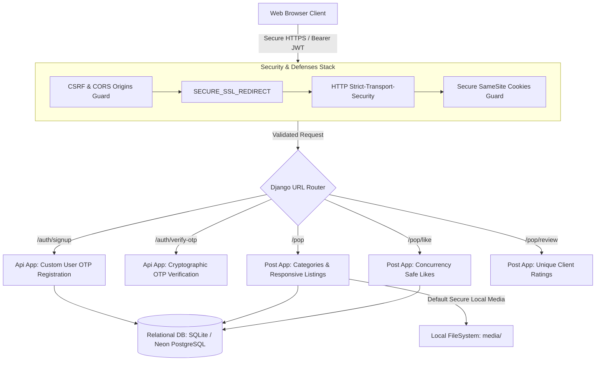

# 🚀 PopDrop — Enterprise-Grade UI Component & Web Template SaaS

[](https://djangoproject.com)
[](https://react.dev)
[](#)
[](#-upgraded-production-security--protection-suite)

PopDrop is a high-performance, enterprise-grade community-driven Software-as-a-Service (SaaS) platform engineered for developers, designers, and creators to share, discover, rate, and seamlessly reuse top-tier web templates and modular UI components. Unlike basic static repositories, PopDrop features a state-of-the-art **stateful OTP validation framework**, **multi-role profile registries**, and an **integrated secure request telemetry pipeline**.

---

## 🏛️ System Architecture Overview

The platform uses a fully decoupled modular layout separated into a responsive React frontend and a highly secure Django REST Framework middleware pipeline. It supports dynamic dual-state databases (SQLite for local development and Neon serverless PostgreSQL for production scaling).



### 📂 Repository Structure & Module Responsibilities

```text
PopDrop/
├── backend/                 # Central Django Project Folder
│   ├── api/                 # OTP verification, Custom User Model, profiles, and team registry
│   ├── post/                # Component registries, categories, reviews, likes, and subscriptions
│   ├── backend/             # Core configurations (urls.py, settings.py, wsgi.py)
│   ├── media/               # Local media directory (user profile images and template previews)
│   └── manage.py            # Command Line Utility
├── frontend/                # Vite React Single Page Application
│   ├── src/                 # Reactive pages, state managers, and reusable layouts
│   ├── index.html           # Root HTML5 DOM container
│   ├── package.json         # Package configuration manifest
│   └── vite.config.js       # Vite assets builder
└── .env                     # Environmental configuration vault (Not checked in)
```

---

## ⏱️ Platform Routes, Paths, and Time-Gated Restrictions

To protect server resources, prevent database write load, and block brute-force scanners, PopDrop enforces strict timing rules and active verification gates across key endpoints:

| URL Path Pattern | System Module / Target | Authorized Role | Security Lockout / Timing Gate / Restriction Logic |
| :--- | :--- | :--- | :--- |
| `/auth/verify-otp/` | **OTP Code Verification** | `guest` / `pre-auth` | **1. Sliding-Window Expiry:** 6-digit numeric OTP validation codes expire exactly **5 minutes** after creation.<br>**2. Dynamic OTP Erasure:** Upon successful validation or code expiry, the OTP key is wiped from the database transactionally to prevent secondary replay attacks. |
| `/auth/resend-otp/` | **Resend Verification Code** | `guest` / `pre-auth` | **1. Rate-Limiting:** Generates and overrides the active user validation session with a new high-entropy OTP, transactionally safe from race conditions. |
| `/auth/profile/` | **Profile Dashboard Update** | `developer` / `designer` | **1. Profile Update Cooldown:** Toggling role updates or updating compliance logs triggers a strict **2-hour cooling-off period** (`next_profile_update_allowed_at`) to secure database write loads. |
| `/pop/review/` | **Submit Review & Rating** | `authenticated` | **1. Strict One-Review Limit:** Enforces a unique client constraint (`one_review_per_user` DB key) preventing a user from posting multiple ratings on the same component. |
| `/api/contact/` | **Submit Contact Inquiries** | `authenticated` | **1. Rate Lockout:** Users are blocked from submitting any new inquiries while a previous ticket is unresolved (`is_checked=False`). |

---

## 🛡️ Upgraded Production Security & Protection Suite

PopDrop implements enterprise-grade defensive layers to safeguard user data, lock down APIs, and ensure robust asset storage:

### 1. 📧 Cryptographic OTP Verification Flow
*   **Dynamic Generation:** Dispatches high-entropy 6-digit verification codes utilizing Django's random integer secure pools.
*   **Wipe-On-Verify:** Immediately nullifies OTP values inside a single database transaction upon verified registration, preventing offline brute-force attempts.
*   **Dynamic Expiry:** Implements a strict **5-minute sliding window**. Past this threshold, active verification tokens are marked invalid, triggering a secure logout.

### 2. 🔑 Enterprise Token-Based Authentication Flow
*   **Access Token Rotation:** Uses REST SimpleJWT architecture with automatically rotating refresh tokens to block session hijacking.
*   **Decoupled Auth Gateway:** Authenticates client-side actions asynchronously via HTTP requests using JWT Bearer headers, keeping client data isolated.

### 3. 🛡️ Advanced Security & Threat-Resistant Protections
*   **Dynamic allowed hosts:** Automatically reads host configurations from the `.env` file and appends live domains dynamically (e.g., Render `*.onrender.com`).
*   **Production Safe Mode:** Enforces `DEBUG = False` and strict production redirects in live environments. Will block the server build instantly if an insecure secret key is used in production.
*   **Dynamic CORS & CSRF Origins:** Replaces wildcarding (`*`) with targeted environmental lists. Dynamically processes secure HTTPS cross-origin protocols for Netlify.
*   **Strict Security Headers:** Injects standard security parameters:
    *   `SECURE_SSL_REDIRECT = True` (redirects all insecure HTTP requests).
    *   `Strict-Transport-Security` HSTS active for 2 years (`max-age=63072000`).
    *   `X-Frame-Options: DENY` (prevents clickjacking attacks).
    *   `X-Content-Type-Options: nosniff` (mitigates MIME-sniffing).
*   **Secure Cookie Storage:** Session parameters and CSRF tokens are locked under `Secure = True`, `HttpOnly = True`, and `SameSite = 'Strict'` settings.

---

## 🗄️ Database Configurations & Storage Architecture

PopDrop utilizes a dynamic dual-state database paradigm and secure local media asset management:

### 1. Dual-State Relational Database Routing
*   **Development Database:** Utilizes a lightweight SQLite relational database (`db.sqlite3`) for seamless local runs.
*   **Production Database:** Employs Neon serverless PostgreSQL or Supabase database clusters dynamically via connection pooling with `dj_database_url`.

### 2. Cloud-Free Image Storage Architecture
*   **Local Storage:** In keeping with standard secure system architecture, PopDrop rejects expensive cloud media dependencies and stores images safely under local filesystem paths using Django's default `FileSystemStorage`:
    *   **User Profiles:** `/media/profile_images/`
    *   **Desktop Component Previews:** `/media/template_previews/desktop/`
    *   **Mobile Component Previews:** `/media/template_previews/mobile/`
*   **Safe Serialization:** The image serializer dynamically reconstructs correct relative and absolute paths depending on the host request domain, making local testing identical to production.

---

## 🚀 Local Installation Guide

### Prerequisites
*   Python 3.10+
*   Node.js & npm

### 1. Backend Setup
1. Navigate to the backend folder:
   ```bash
   cd backend
   ```
2. Create and activate a python virtual environment:
   ```bash
   python -m venv env
   env\Scripts\activate      # Windows
   source env/bin/activate   # Mac/Linux
   ```
3. Install the requirements:
   ```bash
   pip install -r requirements.txt
   ```
4. Run migrations and start the Django server:
   ```bash
   python manage.py migrate
   python manage.py runserver
   ```

### 2. Frontend Setup
1. Navigate to the frontend folder:
   ```bash
   cd ../frontend
   ```
2. Install npm dependencies:
   ```bash
   npm install
   ```
3. Run the development server:
   ```bash
   npm run dev
   ```

---

## 📄 License

This project is licensed under a **Proprietary Commercial License**. All rights reserved. 
Unauthorized cloning, distribution, or commercial hosting is strictly prohibited.
